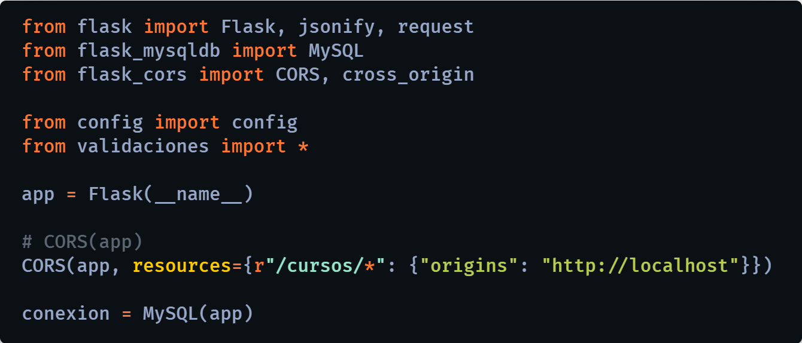
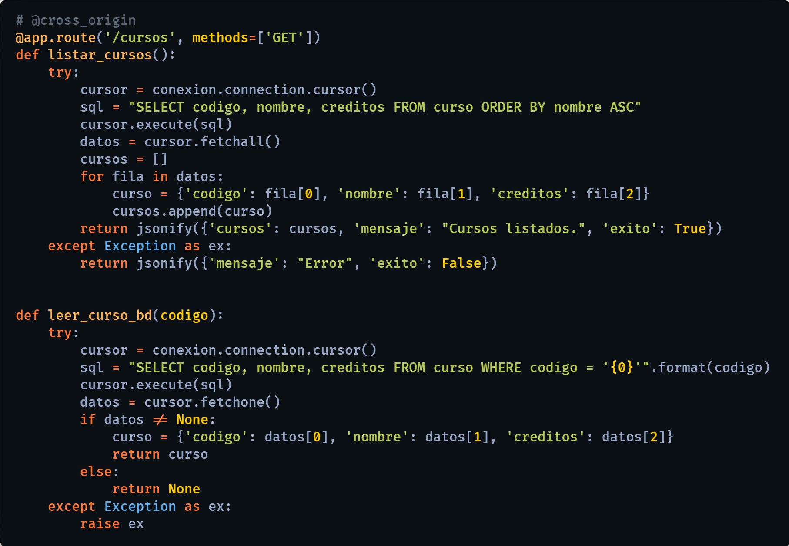

# REST API - Python - Flask - MySQL

REST API creada con Python, el framework web Flask y el SGBD MySQL, con el protocolo HTTP y los método GET, POST, PUT y DELETE.

Para instalar los paquetes necesarios:

### `pip install -r requirements.txt`

  

#YURLEY ANDREA RODRIGUEZ FAJARDO 

